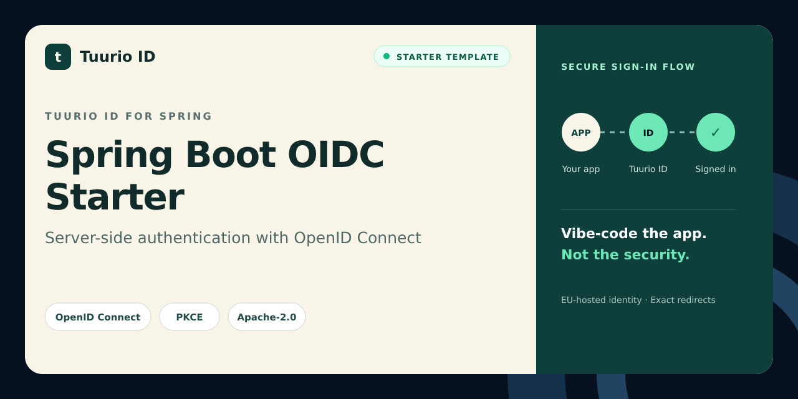

# Spring Boot OIDC Starter

Spring Boot authentication starter for Tuurio ID using Spring Security OAuth2 Client and OpenID Connect.

[](https://github.com/Tuurio/spring-boot-oidc-starter/actions/workflows/verify.yml)



> Generated from [`Tuurio/auth_samples/auth_samples_java`](https://github.com/Tuurio/auth_samples/tree/main/auth_samples_java). Submit implementation fixes upstream so they are not replaced by the next synchronized release.

## What you get

- Standards-based OpenID Connect authentication with framework-native integration.
- Exact redirect and post-logout redirect handling.
- Protected-route and logout examples.
- A reviewed, pinned Tuurio provisioning workflow.

## Quickstart

1. Create a repository with **Use this template** or clone this repository.
2. Follow the framework-specific prerequisites below.
3. Review and run this pinned provisioning command:

```bash
npx manage-tuurio-id@1.1.6 init --framework spring --project-dir . --auth browser --yes --output json --campaign github_spring_boot --no-open --no-wait
```

4. Approve the exact command, then complete the secure browser handoff yourself.
5. Run the build and verify one real sign-in and sign-out.

Never paste credentials, client secrets, authorization codes, tokens, session cookies, or environment-file contents into an agent chat. Browser and native applications are public clients and must not contain a client secret.

## Runtime and verification

- Runtime: Java 17+
- Package manager: Gradle Wrapper
- Verification: `./gradlew --no-daemon test && ./gradlew --no-daemon bootJar`

## Security model

This starter uses OpenID Connect Authorization Code flow. Browser and native clients use PKCE S256 and contain no client secret. Redirect and post-logout redirect URIs must match exactly. Identity comes from the established OIDC integration or an authenticated UserInfo request; decoded JWT payloads are never treated as validation. Keep generated local environment files ignored and never commit tokens or credentials.

## Framework instructions

# Tuurio Auth Java (Spring Boot) Demo

A server-rendered Spring Boot demo that signs in with OAuth 2.0 / OpenID Connect, then displays token contents and a logout button.

## Integration guide

- Detailed integration guide: [Spring Boot example page](https://id.tuurio.com/public/developers/examples/spring-boot)
- General developer docs: [Tuurio ID developers](https://id.tuurio.com/public/developers)

## Setup

```bash
cd auth_samples_java
npx manage-tuurio-id@1.1.6 init --framework spring --project-dir . --auth browser --yes --output json --campaign github_spring_boot --no-open --no-wait
./gradlew bootRun
```

Open `http://localhost:8085`.

## Required client URLs

Configure your Tuurio client with these redirect URLs (matching your `.env` values):

```text
Redirect URI: http://localhost:8085/auth/callback
Post-logout Redirect URI: http://localhost:8085/logout/callback
```

## `.env` keys

```env
TUURIO_ISSUER=https://your-tenant.id.tuurio.com
TUURIO_CLIENT_ID=replace-with-your-server-client-id
TUURIO_CLIENT_SECRET=replace-with-your-client-secret
TUURIO_REDIRECT_URI=http://localhost:8085/auth/callback
TUURIO_POST_LOGOUT_REDIRECT_URI=http://localhost:8085/logout/callback
TUURIO_SCOPE=openid,profile,email
```

Values come from your Tuurio **Connect** page:

```text
https://<tenantId>.id.tuurio.com/admin/clients
```


## License

Licensed under the Apache License, Version 2.0. See [`LICENSE`](./LICENSE).
